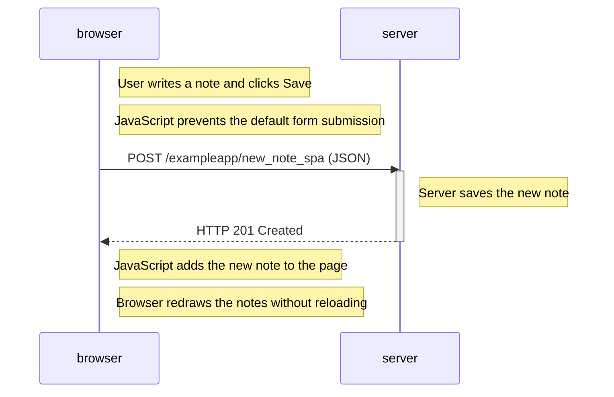

```mermaid
sequenceDiagram
    participant browser
    participant server

    Note right of browser: User writes a note and clicks Save
    Note right of browser: JavaScript prevents the default form submission

    browser->>server: POST /exampleapp/new_note_spa (JSON)
    activate server
    Note right of server: Server saves the new note
    server-->>browser: HTTP 201 Created
    deactivate server

    Note right of browser: JavaScript adds the new note to the page
    Note right of browser: Browser redraws the notes without reloading
```
